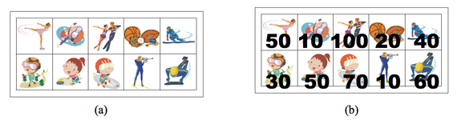

# [BOJ] 9465번 스티커

백준온라인저지(BOJ) :  https://www.acmicpc.net/problem/9465


## 1. 문제 설명

| 시간 제한 | 메모리 제한 | 
| :-------- | :---------- |
| 1 초      | 256 MB      | 

### 문제

상근이의 여동생 상냥이는 문방구에서 스티커 2n개를 구매했다. 스티커는 그림 (a)와 같이 2행 n열로 배치되어 있다. 상냥이는 스티커를 이용해 책상을 꾸미려고 한다.

상냥이가 구매한 스티커의 품질은 매우 좋지 않다. 스티커 한 장을 떼면, 그 스티커와 변을 공유하는 스티커는 모두 찢어져서 사용할 수 없게 된다. 즉, 뗀 스티커의 왼쪽, 오른쪽, 위, 아래에 있는 스티커는 사용할 수 없게 된다.



모든 스티커를 붙일 수 없게된 상냥이는 각 스티커에 점수를 매기고, 점수의 합이 최대가 되게 스티커를 떼어내려고 한다. 먼저, 그림 (b)와 같이 각 스티커에 점수를 매겼다. 상냥이가 뗄 수 있는 스티커의 점수의 최댓값을 구하는 프로그램을 작성하시오. 즉, 2n개의 스티커 중에서 점수의 합이 최대가 되면서 서로 변을 공유 하지 않는 스티커 집합을 구해야 한다.

위의 그림의 경우에 점수가 50, 50, 100, 60인 스티커를 고르면, 점수는 260이 되고 이 것이 최대 점수이다. 가장 높은 점수를 가지는 두 스티커 (100과 70)은 변을 공유하기 때문에, 동시에 뗄 수 없다.

### 입력

첫째 줄에 테스트 케이스의 개수 T가 주어진다. 각 테스트 케이스의 첫째 줄에는 n (1 ≤ n ≤ 100,000)이 주어진다. 다음 두 줄에는 n개의 정수가 주어지며, 각 정수는 그 위치에 해당하는 스티커의 점수이다. 연속하는 두 정수 사이에는 빈 칸이 하나 있다. 점수는 0보다 크거나 같고, 100보다 작거나 같은 정수이다.

### 출력

각 테스트 케이스 마다, 2n개의 스티커 중에서 두 변을 공유하지 않는 스티커 점수의 최댓값을 출력한다.

#### 예제 입력 1

```
2
5
50 10 100 20 40
30 50 70 10 60
7
10 30 10 50 100 20 40
20 40 30 50 60 20 80
```

#### 예제 출력 1

```
260
290
```


## 2. 내 소스 코드

```python
######1.######
import sys

if __name__ == "__main__":
    t = int(input())

    for _ in range(t):
        n = int(input())
        dp = [[0] * n for _ in range(2)]
        stickers = []
        for _ in range(2):
            stickers.append(list(map(int, input().split())))

        up, down, none = 0, 0, 0

        for i in range(n):
            up, down, none = max(down, none) + stickers[0][i], max(up, none) + stickers[1][i], max(up, down)

        print(max(up, down, none))

######2.######
import sys

if __name__ == "__main__":
    t = int(input())

    for _ in range(t):
        n = int(input())
        dp = [[0] * n for _ in range(2)]
        stickers = []
        for _ in range(2):
            stickers.append(list(map(int, input().split())))

        dp[0][0], dp[1][0] = stickers[0][0], stickers[1][0]

        for i in range(1, n):
            dp[0][i] += max(dp[0][i-1], dp[1][i-1] + stickers[0][i])
            dp[1][i] += max(dp[1][i-1], dp[0][i-1] + stickers[1][i])

        print(max(dp[0][n-1], dp[1][n-1]))
```


## 3. 풀이 & 개선점

이 문제 또한 혼자 풀다가 해결하지 못해 다른 사람들의 풀이를 참고했다.  
여러 사람들의 풀이를 보는데도 이해가 힘들었는데, 거의 다 같은 풀이여서 조금 더 생각을 해봐야할 것 같다.  
이 중 내가 이해한 코드의 풀이는 두 가지다.

### 1.

_Step 1._  
스티커의 점수 리스트를 입력받은 후에, 위쪽 스티커를 뗀 경우(`up`), 아래쪽 스티커를 뗀 경우(`down`), 아무것도 떼지 않은 경우(`non`) 세 가지로 나누어 값을 구해간다.

_Step 2._  
for문을 돌면서 위쪽 스티커를 뗀 경우에는 `max(이전에 아래 스티커를 뗀 경우, 아무것도 떼지 않은 경우)`,  
아래쪽 스티커를 뗀 경우에는 `max(이전에 위쪽 스티커를 뗀 경우, 아무것도 떼지 않은 경우)`,  
아무것도 떼지 않은 경우에는 `max(이전에 위쪽 스티커를 뗀 경우, 이전에 아래 스티커를 뗀 경우)`로 나누어 구한다.

```
for i in range(n):
    up, down, non = max(down, non) + stickers[0][i], max(up, non) + stickers[1][i], max(up, down)    
```

_Step 3._  
이렇게 for문을 n번 모두 돌게 되면 그 중 가장 큰 값이 우리가 구하는 값임을 알 수 있다.

### 2.

_Step 1._  
점화식을 찾기가 힘들었는데, i번째 인덱스의 DP table (`dp[0][i], dp[1][i]`)은 같은 행, i-1번째 인덱스의 값을 그대로 갖거나 대각선에 위치한 i-1번째 인덱스의 값에 해당 `stickers`점수를 더해준 값을 비교해 더 큰 값을 갖는다.

_Step 2._  
즉, 점화식은 `dp[0][i] = max(dp[0][i-1], dp[1][i-1] + stickers[0][i]), dp[1][i] = max(dp[1][i-1], dp[0][i-1] + stickers[1][i])` 이다.

### 느낀점

채점을 해본 후에 메모리 사용량과 걸린 시간을 비교해보면 첫번째 방법이 모든 측면에서 효율적인 것을 볼 수 있었다.  
다이나믹 프로그래밍은 적절한 점화식을 빠르게 찾는 것이 중요한 것 같다.  
이 문제는 Solved.ac 기준 실버 2의 난이도인데, 이렇게 고생한 건 더 많이 풀어보면서 보완해야 할 점인 것 같다.