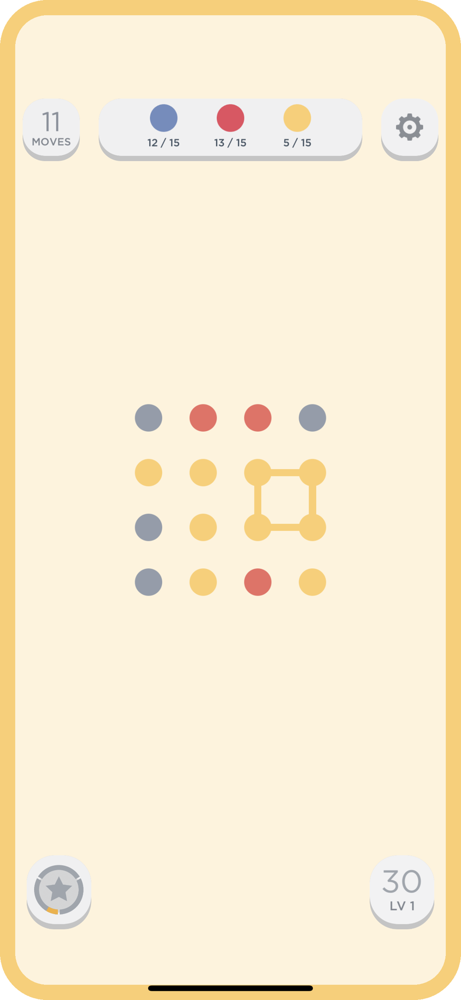

# [BOJ] 16929번 Two Dots

백준온라인저지(BOJ) :  https://www.acmicpc.net/problem/16929


## 1. 문제 설명

| 시간 제한 | 메모리 제한 | 
| :-------- | :---------- |
| 2 초      | 512 MB      | 

### 문제

Two Dots 는 Playdots, Inc.에서 만든 게임이다. 게임의 기초 단계는 크기가 N×M인 게임판 위에서 진행된다.

각각의 칸은 색이 칠해진 공이 하나씩 있다. 이 게임의 핵심은 같은 색으로 이루어진 사이클을 찾는 것이다.

다음은 위의 게임판에서 만들 수 있는 사이클의 예시이다.

 

점 k개 d1, d2, ..., dk로 이루어진 사이클의 정의는 아래와 같다.

- 모든 k개의 점은 서로 다르다.
- k는 4보다 크거나 같다.
- 모든 점의 색은 같다.
- 모든 1 ≤ i ≤ k-1에 대해서, di와 di+1은 인접하다. 또, dk와 d1도 인접해야 한다. 두 점이 인접하다는 것은 각각의 점이 들어있는 칸이 변을 공유한다는 의미이다.

게임판의 상태가 주어졌을 때, 사이클이 존재하는지 아닌지 구해보자.

### 입력

첫째 줄에 게임판의 크기 N, M이 주어진다. 둘째 줄부터 N개의 줄에 게임판의 상태가 주어진다. 게임판은 모두 점으로 가득차 있고, 게임판의 상태는 점의 색을 의미한다. 점의 색은 알파벳 대문자 한 글자이다.

### 출력

사이클이 존재하는 경우에는 "Yes", 없는 경우에는 "No"를 출력한다.

#### 예제 입력 1

```
3 4
AAAA
ABCA
AAAA
```

#### 예제 출력 1

```
YES
```

#### 예제 입력 2

```
3 4
AAAA
ABCA
AADA
```

#### 예제 출력 2

```
NO
```


## 2. 내 소스 코드

```python
import sys

input = sys.stdin.readline

dx = [0, 1, 0, -1]
dy = [1, 0, -1, 0]

def DFS(x, y, l, graph, visited):
    global check, s_i, s_j

    visited[x][y] = True

    if check:
        return

    l += 1
    for i in range(4):
        nx = x + dx[i]
        ny = y + dy[i]

        if 0 <= nx < n and 0 <= ny < m:
            if i == 3 and l >= 4 and nx == s_i and ny == s_j:
                check = True
                return
            if not visited[nx][ny] and graph[nx][ny] == graph[x][y]:
                visited[nx][ny] = True
                DFS(nx, ny, l, graph, visited)
                visited[nx][ny] = False
                l -= 1


if __name__ == "__main__":
    n, m = map(int, input().split())
    graph = []
    for _ in range(n):
        graph.append(list(map(str, input().rstrip())))

    visited = [[False] * m for _ in range(n)]
    check = False
    for i in range(n):
        for j in range(m):
            if not visited[i][j]:
                s_i, s_j = i, j
                DFS(i, j, 1, graph, visited)
                if check:
                    print("Yes")
                    break
        if check:
            break
    else:
        print("No")
```


## 3. 풀이 & 개선점

```python
```