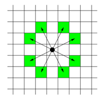

# [BOJ] 7562번 나이트의 이동

백준온라인저지(BOJ) :  https://www.acmicpc.net/problem/7562


## 1. 문제 설명

| 시간 제한 | 메모리 제한 | 
| :-------- | :---------- |
| 1 초      | 256 MB      | 

### 문제

체스판 위에 한 나이트가 놓여져 있다. 나이트가 한 번에 이동할 수 있는 칸은 아래 그림에 나와있다. 나이트가 이동하려고 하는 칸이 주어진다. 나이트는 몇 번 움직이면 이 칸으로 이동할 수 있을까?



### 입력

입력의 첫째 줄에는 테스트 케이스의 개수가 주어진다.

각 테스트 케이스는 세 줄로 이루어져 있다. 첫째 줄에는 체스판의 한 변의 길이 l(4 ≤ l ≤ 300)이 주어진다. 체스판의 크기는 l × l이다. 체스판의 각 칸은 두 수의 쌍 {0, ..., l-1} × {0, ..., l-1}로 나타낼 수 있다. 둘째 줄과 셋째 줄에는 나이트가 현재 있는 칸, 나이트가 이동하려고 하는 칸이 주어진다.


### 출력

각 테스트 케이스마다 나이트가 최소 몇 번만에 이동할 수 있는지 출력한다.

#### 예제 입력 1

```
3
8
0 0
7 0
100
0 0
30 50
10
1 1
1 1
```

#### 예제 출력 1

```
5
28
0
```


## 2. 내 소스 코드

```python
import sys
from collections import deque

input = sys.stdin.readline

dx = [-2, -1, 1, 2, 2, 1, -1, -2]
dy = [1, 2, 2, 1, -1, -2, -2, -1]

def BFS(x, y):
    global cnt

    queue = deque()
    visited[x][y] = True
    queue.append((x, y))

    while queue:
        x, y = queue.popleft()
        if x == final_i and y == final_j:
            return graph[x][y]

        else:
            for i in range(8):
                nx = x + dx[i]
                ny = y + dy[i]

                if 0 <= nx < l and 0 <= ny < l:
                    if not visited[nx][ny]:
                        visited[nx][ny] = True
                        graph[nx][ny] = graph[x][y] + 1
                        queue.append((nx, ny))


if __name__ == "__main__":
    t = int(input())
    for _ in range(t):
        l = int(input())
        graph = [[0] * l for _ in range(l)]
        start_i, start_j = map(int, input().split())
        final_i, final_j = map(int, input().split())

        visited = [[False] * l for _ in range(l)]
        cnt = 0
        print(BFS(start_i, start_j))
```


## 3. 풀이 & 개선점

```python

```