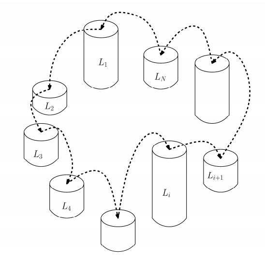

# [BOJ] 11497번 통나무 건너뛰기

백준온라인저지(BOJ) :  https://www.acmicpc.net/problem/11497


## 1. 문제 설명

| 시간 제한 | 메모리 제한 | 
| :-------- | :---------- |
| 1 초      | 256 MB      | 

### 문제

남규는 통나무를 세워 놓고 건너뛰기를 좋아한다. 그래서 N개의 통나무를 원형으로 세워 놓고 뛰어놀려고 한다. 남규는 원형으로 인접한 옆 통나무로 건너뛰는데, 이때 각 인접한 통나무의 높이 차가 최소가 되게 하려 한다.



통나무 건너뛰기의 난이도는 인접한 두 통나무 간의 높이의 차의 최댓값으로 결정된다. 높이가 {2, 4, 5, 7, 9}인 통나무들을 세우려 한다고 가정하자. 이를 [2, 9, 7, 4, 5]의 순서로 세웠다면, 가장 첫 통나무와 가장 마지막 통나무 역시 인접해 있다. 즉, 높이가 2인 것과 높이가 5인 것도 서로 인접해 있다. 배열 [2, 9, 7, 4, 5]의 난이도는 |2-9| = 7이다. 우리는 더 나은 배열 [2, 5, 9, 7, 4]를 만들 수 있으며 이 배열의 난이도는 |5-9| = 4이다. 이 배열보다 난이도가 낮은 배열은 만들 수 없으므로 이 배열이 남규가 찾는 답이 된다.

### 입력

입력은 T개의 테스트 케이스로 이루어져 있다. 첫 줄에 T가 주어진다.

이어지는 각 줄마다 첫 줄에 통나무의 개수를 나타내는 정수 N(5 ≤ N ≤ 10,000), 둘째 줄에 각 통나무의 높이를 나타내는 정수 Li가 주어진다. (1 ≤ Li ≤ 100,000)

### 출력

각 테스트 케이스마다 한 줄에 주어진 통나무들로 만들 수 있는 최소 난이도를 출력하시오.

#### 예제 입력 1

```
3
7
13 10 12 11 10 11 12
5
2 4 5 7 9
8
6 6 6 6 6 6 6 6
```

#### 예제 출력 1

```
1
4
0
```


## 2. 내 소스 코드

```python
t = int(input())

for _ in range(t):
    n = int(input())
    logs = list(map(int, input().split()))

    logs.sort(reverse=True)
    new_logs = []
    for i in range(n):
        if i % 2 == 0:
            new_logs.append(logs[i])
        else:
            new_logs.insert(0, logs[i])

    maximum_height_difference = abs(new_logs[0] - new_logs[-1])
    for i in range(1, n):
        if abs(new_logs[i] - new_logs[i - 1]) >maximum_height_difference:
            maximum_height_difference = abs(new_logs[i] - new_logs[i - 1])

    print(maximum_height_difference)
```


## 3. 풀이 & 개선점

```python
 이 문제를 위처럼 해결한 것은 정말 말 그대로 그리디하게 해결했다. 가장 높이가 높은 통나무를 가운데 배치하고 순서대로 왼쪽, 오른쪽을 번갈아가면서
통나무들을 배치하고 그 차이를 비교한 후 최대값을 구했다.
 다른 사람들의 풀이를 보니 개념은 같은데 접근을 다른 방식으로 한 것 같아 참고해봐야 할 것 같다.
```