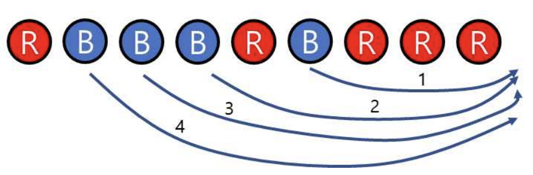

# [BOJ] 17615번 볼 모으기

백준온라인저지(BOJ) :  https://www.acmicpc.net/problem/17615


## 1. 문제 설명

| 시간 제한 | 메모리 제한 | 
| :-------- | :---------- |
| 1 초      | 512 MB      | 

### 문제

빨간색 볼과 파란색 볼이 <그림 1>에서 보인 것처럼 일직선상에 섞여 놓여 있을 때, 볼을 옮겨서 같은 색 볼끼리 인접하게 놓이도록 하려고 한다. 볼을 옮기는 규칙은 다음과 같다.

1. 바로 옆에 다른 색깔의 볼이 있으면 그 볼을 모두 뛰어 넘어 옮길 수 있다. 즉, 빨간색 볼은 옆에 있는 파란색 볼 무더기를 한 번에 뛰어 넘어 옮길 수 있다. 유사하게, 파란색 볼은 옆에 있는 빨간색 볼 무더기를 한 번에 뛰어 넘어 옮길 수 있다.
2. 옮길 수 있는 볼의 색깔은 한 가지이다. 즉, 빨간색 볼을 처음에 옮겼으면 다음에도 빨간색 볼만 옮길 수 있다. 유사하게, 파란색 볼을 처음에 옮겼으면 다음에도 파란색 볼만 옮길 수 있다.

예를 들어, 처음에 볼이 <그림 1>에서 보인 것처럼 있을 때, 빨간 볼을 <그림 2>에서 보인 것처럼 옮긴 후, <그림 3>에서 보인 것처럼 옮긴다면 두 번 만에 같은 색끼리 모을 수 있다.


<그림 1>


<그림 2>


<그림 3>

반면에 파란색 볼을 선택하여 에서 보인 것처럼 옮기면(화살표에 있는 수는 옮기는 순서를 나타낸다) 네 번을 옮겨야 같은 색의 볼끼리 모을 수 있다.



<그림 4>

일직선상에 놓여 있는 볼에 관한 정보가 주어질 때, 규칙에 따라 볼을 이동하여 같은 색끼리 모으되 최소 이동횟수를 찾는 프로그램을 작성하시오.

### 입력

첫 번째 줄에는 볼의 총 개수 N이 주어진다. (1 ≤ N ≤ 500,000) 다음 줄에는 볼의 색깔을 나타내는 문자 R(빨간색 볼) 또는 B(파란색 볼)가 공백 없이 주어진다. 문자열에는 R 또는 B 중 한 종류만 주어질 수도 있으며, 이 경우 답은 0이 된다.

### 출력

최소 이동횟수를 출력한다.

#### 예제 입력 1

```
9
RBBBRBRRR
```

#### 예제 출력 1

```
2
```

#### 예제 입력 2

```
8
BBRBBBBR
```

#### 예제 출력 2

```
1
```


## 2. 내 소스 코드

```python
n = int(input())

balls = list(input())

cnt = 1
cnt_list = []
for i in range(1, n):
    if balls[i - 1] == balls[i]:
        cnt += 1
    else:
        cnt_list.append(cnt)
        cnt = 1
    if i == n - 1:
        cnt_list.append(cnt)

sum_even_right, sum_odd_right = 0, 0
for i in range(len(cnt_list) - 1):
    if i % 2 == 0:
        sum_even_right += cnt_list[i]
    else:
        sum_odd_right += cnt_list[i]

sum_even_left, sum_odd_left = 0, 0
for i in range(1, len(cnt_list)):
    if i % 2 == 0:
        sum_even_left += cnt_list[i]
    else:
        sum_odd_left += cnt_list[i]
print(min(sum_even_right, sum_odd_right, sum_even_left, sum_odd_left))
```


## 3. 풀이 & 개선점

```python
 이 문제의 답은 4가지의 경우 중 하나이다. 1) R을 오른쪽으로 옮기기 2) B를 오른쪽으로 옮기기 3) R을 왼쪽으로 옮기기 4) B를 왼쪽으로 옮기기
여기서 나는 먼저 공의 리스트에서 색깔별로 몇개씩 있는지 갯수를 리스트로 다시 만들었고, 계산할 때는 RBRBRB.. 혹은 BRBRBR.. 반복되기 때문에 
R인지 B인지 상관없이 짝수번째와 홀수번째로 나눠 오른쪽으로 옮기는 것과 왼쪽으로 옮기는 것 중 가장 작은 값을 구하였다.
 다른 사람의 코드를 보던 중 훨씬 쉽게 짠 알고리즘이 있어서 가져왔다. 기본적으로 개념은 같지만 더 보기 좋게 코드를 작성한 것 같다. 
#######
# 움직이려는 색깔 공이 뭉터기 되어 있는 부분은 고려할 필요가 없으니 pop!
def init(color, ball):
    for _ in range(len(ball)):
        c = ball.pop()
        if c != color :
            ball.append(c)
            break
    return ball

# pop 처리 된 ball 중에서, 움직이려는 공의 개수만큼이 최소 이동횟수이다.
def move(color, ball):
    ball = init(color, ball)
    return ball.count(color)

N = int(input())
ball = list(input())

print(min(move('R',ball[:]), move('R',ball[::-1]), move('B',ball[:]), move('B',ball[::-1]))
```