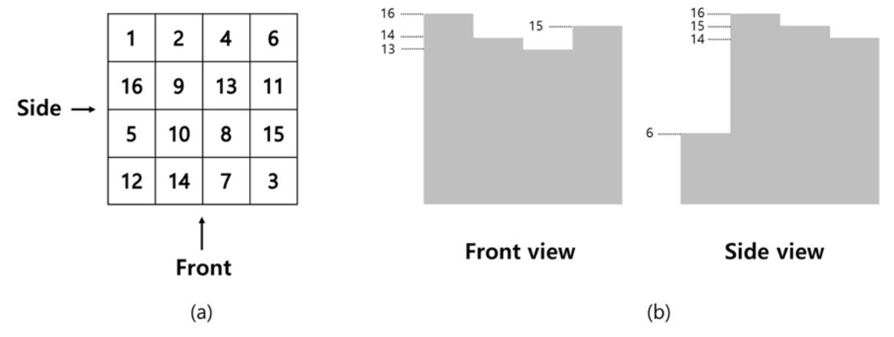
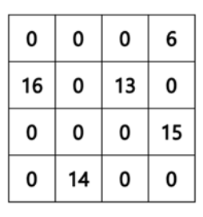

# [BOJ] 14754번 Pizza Boxes

백준온라인저지(BOJ) :  https://www.acmicpc.net/problem/14754


## 1. 문제 설명

| 시간 제한 | 메모리 제한 | 
| :-------- | :---------- |
| 1 초      | 512 MB      | 

### 문제

There are pizza boxes all of which have the same dimensions. The boxes are stacked in piles, forming a three- dimensional grid where the heights are all different. The view from front shows the height of the tallest pile in each column, the view from the side shows the height of the tallest pile in each row.

What is the maximum number of pizza boxes we can remove without changing the front and side views? In the following example, Figure I.2 shows the solution of Figure I.1(a) case. In Figure I.1(a) and Figure I.2, each number (height) represents the number of boxes stacked.


Figure I.1. (a) Grid of heights and (b) the corresponding views.

Figure I.2. Grid of heights after removing boxes.

Your task is to compute the maximum number of pizza boxes that can be removed without changing the original front and side views.


### 입력

Your program is to read from standard input. The input contains two integers, n and m (1 ≤ n, m ≤ 1,000), the number of rows and columns in the grid, respectively. Each of the following n lines contain m integers, the number of pizza boxes (heights) in the corresponding row. All heights are between 0 and 109 inclusive and the heights are all different.

### 출력

Your program is to write to standard output. Print exactly one line for the input. The line should contain the maximum number of pizza boxes that can be removed without changing the original views..

#### 예제 입력 1

```
4 4
1 2 4 6
16 9 13 11
5 10 8 15
12 14 7 3
```

#### 예제 출력 1

```
72
```

#### 예제 입력 2

```
3 5
1 11 25 20 23
17 2 16 21 15
10 3 12 24 22
```

#### 예제 출력 2

```
101
```


## 2. 내 소스 코드

```python
n, m = map(int, input().split())

boxes = []
after_removeBox = set()
initial_sum = 0

for i in range(n):
    boxes.append(list(map(int, input().split())))
    after_removeBox.add(max(boxes[i]))
    initial_sum += sum(boxes[i])

for j in range(m):
    after_removeBox.add(max(boxes[i][j] for i in range(n)))

print(initial_sum - sum(after_removeBox))
```


## 3. 풀이 & 개선점

```python
 이 문제는 주어진 박스들을 row, column별로 최대값을 구하고 그를 제외한 나머지 값들의 합을 구하는 문제다. 어떻게 하면 자료들을 효율적으로
저장할 수 있을지 몰랐는데 set자료형을 사용하면 중복을 피할 수 있기 때문에 다시 한번 자료형의 필요성을 느낄 수 있었다.
```