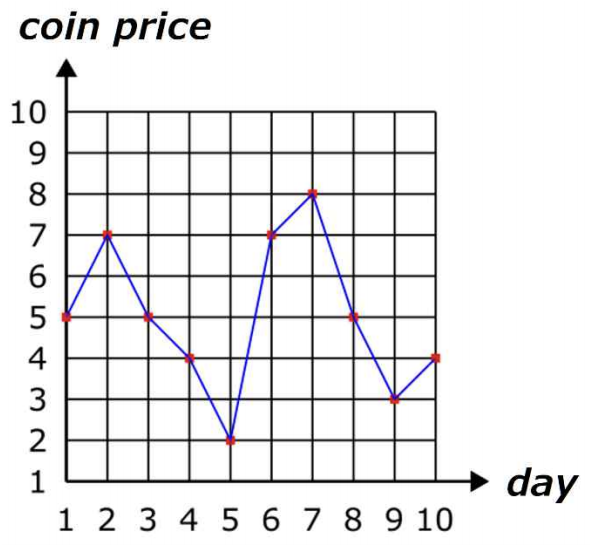

# [BOJ] 17521번 Byte Coin

백준온라인저지(BOJ) :  https://www.acmicpc.net/problem/17521


## 1. 문제 설명

| 시간 제한 | 메모리 제한 | 
| :-------- | :---------- |
| 0.5 초      | 512 MB      | 

### 문제

국제자본부동산회사(ICPC)는 바이트 코인(Byte Coin)에 자금을 투자하고 있다. 바이트 코인은 김박사가 만든 가상 화폐이다. 실제로는 바이트 코인 가격을 예상할 수 없지만 이 문제에서는 바이트 코인 가격 등락을 미리 정확히 예측할 수 있다고 가정하자.

우리는 1일부터 n일까지 n일 동안 그림 1과 같이 바이트 코인의 등락을 미리 알 수 있으며 우리에게는 초기 현금 W가 주어져 있다. 그림 1의 빨간색 네모는 해당 일자의 바이트 코인 가격을 나타낸다. 매일 바이트 코인을 매수하거나 매도할 수 있다고 하자. 다만 바이트 코인 하나를 나누어 매도하거나 매수할 수는 없다. 우리는 n일 날 보유하고 있는 모든 코인을 매도할 때 가지고 있는 현금을 최대화하고 싶다.



예를 들어, 그림 1과 같은 바이트 코인 등락 그래프를 첫날 미리 알 수 있다고 하고 우리에게 주어진 초기 현금이 24라고 하자. 수익을 최대한 높이려면 다음과 같이 바이트 코인을 매수, 매도할 수 있다. 첫 날 현금 20을 써서 4개의 코인을 산다. 둘째 날 모든 코인을 매도해서 현금 28을 얻고 모두 32의 현금을 갖게 된다. 5일째 되는 날 현금 32를 써서 16개의 코인을 매수한다. 7일째 되는 날 모든 코인을 매도해서 모두 128의 현금을 갖게 된다. 9일째 되는 날 현금 126을 써서 42개의 코인을 사고 10일 날 모든 코인을 매도한다. 그러면 10일 날 현금이 170이 되고 이것이 최대이다.

요일 수 n, 초기 현금 W, 1일부터 n일까지 각 요일의 바이트 코인 가격이 주어질 때, n일 날 보유하고 있는 모든 코인을 매도할 때 보유하게 될 최종 현금의 최댓값을 출력하는 프로그램을 작성하시오.

### 입력

입력은 표준입력을 사용한다. 첫 번째 줄에 요일 수를 나타내는 양의 정수 n과 초기 현금 W(1 ≤ n ≤ 15, 1 ≤ W ≤ 100,000)가 주어진다. 다음 n 개의 줄에서, i번째 줄은 i일의 바이트 코인 가격을 나타내는 정수 si가 주어진다(1 ≤ si ≤ 50).

### 출력

출력은 표준출력을 사용한다. n일 날 보유하고 있는 모든 코인을 매도할 때 가지고 있는 현금의 최댓값을 한 행에 출력한다. 비록 초기 현금 W는 그렇게 크지 않지만 최종 현금은 매우 커질 수 있음에 주의하자.


#### 예제 입력 1

```
10 24
5
7
5
4
2
7
8
5
3
4
```

#### 예제 출력 1

```
170
```

#### 예제 입력 2

```
5 15
5
4
4
2
7
```

#### 예제 출력 2

```
50
```

#### 예제 입력 3

```
7 54
7
5
5
4
2
2
1
```

#### 예제 출력 3

```
54
```


## 2. 내 소스 코드

```python
n, W = map(int, input().split())

price = []
coin = 0

for _ in range(n):
    price.append(int(input()))

for i in range(1, n):
    if (price[i] > price[i - 1]):
        if (W // price[i - 1] > 0):
            coin = (W // price[i - 1])
            W -= price[i - 1] * coin
    elif (price[i] < price[i - 1]):
        W += price[i - 1] * coin
        coin = 0
if (coin > 0):
    W += coin * price[-1]

print(W)
```


## 3. 풀이 & 개선점

```python
 바이트코인의 그래프를 보고 상승하는 그래프라면 구매하고, 하강하는 그래프라면 판매를 한다. 
 리스트의 연속된 두 수를 비교할때는, i와 i + 1을 비교하는 것보다 i와 i - 1을 비교하는 것이 조금 더 에러가 줄어드는 것 같다.
```