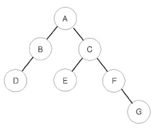

# [BOJ] 1991번 트리 순회

백준온라인저지(BOJ) :  https://www.acmicpc.net/problem/1991


## 1. 문제 설명

| 시간 제한 | 메모리 제한 | 
| :-------- | :---------- |
| 2 초      | 128 MB      | 

### 문제

이진 트리를 입력받아 전위 순회(preorder traversal), 중위 순회(inorder traversal), 후위 순회(postorder traversal)한 결과를 출력하는 프로그램을 작성하시오.



예를 들어 위와 같은 이진 트리가 입력되면,

- 전위 순회한 결과 : ABDCEFG // (루트) (왼쪽 자식) (오른쪽 자식)
- 중위 순회한 결과 : DBAECFG // (왼쪽 자식) (루트) (오른쪽 자식)
- 후위 순회한 결과 : DBEGFCA // (왼쪽 자식) (오른쪽 자식) (루트)
가 된다.

### 입력

첫째 줄에는 이진 트리의 노드의 개수 N(1≤N≤26)이 주어진다. 둘째 줄부터 N개의 줄에 걸쳐 각 노드와 그의 왼쪽 자식 노드, 오른쪽 자식 노드가 주어진다. 노드의 이름은 A부터 차례대로 영문자 대문자로 매겨지며, 항상 A가 루트 노드가 된다. 자식 노드가 없는 경우에는 .으로 표현된다.

### 출력

첫째 줄에 전위 순회, 둘째 줄에 중위 순회, 셋째 줄에 후위 순회한 결과를 출력한다. 각 줄에 N개의 알파벳을 공백 없이 출력하면 된다.

#### 예제 입력 1

```
7
A B C
B D .
C E F
E . .
F . G
D . .
G . .
```

#### 예제 출력 1

```
ABDCEFG
DBAECFG
DBEGFCA
```


## 2. 내 소스 코드

```python
import sys
ROOT = 'A'

def pre_order(v):
    if v == '.':
        return
    else:
        print(v, end='')
        pre_order(graph[ord(v) - ord(ROOT)][0])
        pre_order(graph[ord(v) - ord(ROOT)][1])

def in_order(v):
    if v == '.':
        return
    else:
        in_order(graph[ord(v) - ord(ROOT)][0])
        print(v, end='')
        in_order(graph[ord(v) - ord(ROOT)][1])


def post_order(v):
    if v == '.':
        return
    else:
        post_order(graph[ord(v) - ord(ROOT)][0])
        post_order(graph[ord(v) - ord(ROOT)][1])
        print(v, end='')


if __name__ == "__main__":
    n = int(input())
    graph = [[] for _ in range(26)]
    for _ in range(n):
        root, lc, rc = map(str, input().rstrip().split())
        graph[ord(root)-65].append(lc)
        graph[ord(root)-65].append(rc)
    visited = [False] * 26

    pre_order(ROOT)
    print()
    in_order(ROOT)
    print()
    post_order(ROOT)
```


## 3. 풀이 & 개선점

```python
```