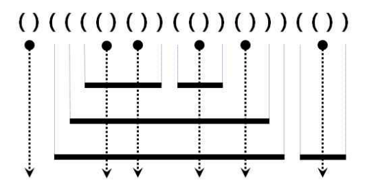

# [BOJ] 10799번 쇠막대기

백준온라인저지(BOJ) :  https://www.acmicpc.net/problem/10799


## 1. 문제 설명

| 시간 제한 | 메모리 제한 | 
| :-------- | :---------- |
| 1 초      | 256 MB      | 

### 문제

여러 개의 쇠막대기를 레이저로 절단하려고 한다. 효율적인 작업을 위해서 쇠막대기를 아래에서 위로 겹쳐 놓고, 레이저를 위에서 수직으로 발사하여 쇠막대기들을 자른다. 쇠막대기와 레이저의 배치는 다음 조건을 만족한다.

- 쇠막대기는 자신보다 긴 쇠막대기 위에만 놓일 수 있다. - 쇠막대기를 다른 쇠막대기 위에 놓는 경우 완전히 포함되도록 놓되, 끝점은 겹치지 않도록 놓는다.
- 각 쇠막대기를 자르는 레이저는 적어도 하나 존재한다.
- 레이저는 어떤 쇠막대기의 양 끝점과도 겹치지 않는다.

아래 그림은 위 조건을 만족하는 예를 보여준다. 수평으로 그려진 굵은 실선은 쇠막대기이고, 점은 레이저의 위치, 수직으로 그려진 점선 화살표는 레이저의 발사 방향이다.



이러한 레이저와 쇠막대기의 배치는 다음과 같이 괄호를 이용하여 왼쪽부터 순서대로 표현할 수 있다.

1. 레이저는 여는 괄호와 닫는 괄호의 인접한 쌍 ‘( ) ’ 으로 표현된다. 또한, 모든 ‘( ) ’는 반드시 레이저를 표현한다.
2. 쇠막대기의 왼쪽 끝은 여는 괄호 ‘ ( ’ 로, 오른쪽 끝은 닫힌 괄호 ‘) ’ 로 표현된다.

위 예의 괄호 표현은 그림 위에 주어져 있다.

쇠막대기는 레이저에 의해 몇 개의 조각으로 잘려지는데, 위 예에서 가장 위에 있는 두 개의 쇠막대기는 각각 3개와 2개의 조각으로 잘려지고, 이와 같은 방식으로 주어진 쇠막대기들은 총 17개의 조각으로 잘려진다.

쇠막대기와 레이저의 배치를 나타내는 괄호 표현이 주어졌을 때, 잘려진 쇠막대기 조각의 총 개수를 구하는 프로그램을 작성하시오.

### 입력

한 줄에 쇠막대기와 레이저의 배치를 나타내는 괄호 표현이 공백없이 주어진다. 괄호 문자의 개수는 최대 100,000이다.

### 출력

잘려진 조각의 총 개수를 나타내는 정수를 한 줄에 출력한다.


#### 예제 입력 1

```
()(((()())(())()))(())
```

#### 예제 출력 1

```
17
```

#### 예제 입력 2

```
(((()(()()))(())()))(()())
```

#### 예제 출력 2

```
24
```

## 2. 내 소스 코드

```python
import sys

input = sys.stdin.readline

if __name__ == "__main__":
    pipes = input().rstrip()
    stack = []
    res = 0

    for i in range(len(pipes)):
        if pipes[i] == '(':
            stack.append(pipes[i])

        else:
            stack.pop()
            if pipes[i-1] == '(':
                res += len(stack)
            else:
                res += 1

    print(res)
```


## 3. 풀이 & 개선점

이 문제는 스택을 이용하여 해결할 수 있는 문제이다.

_Step 1._  
&nbsp;입력으로 주어진 쇠막대기와 레이저의 배치를 `pipes`로 받고 for문을 이용해 앞에서부터 탐색을 시작한다.  
&nbsp;`(`를 만나면 `stack`에 push해준다.

_Step 2._  
&nbsp;`)`를 만나면 `pipes`의 바로 전 인덱스를 살펴보고 만약 `pipes[i-1]`이 `(`라면 레이저이기 때문에 `stack`에서 pop해주고 `res`에 `stack`의 길이만큼 더해준다.  
&nbsp;그렇지 않고 `pipes[i-1]`이 `)`라면 해당 라인의 막대기가 끝나는 지점이기 때문에 `res`에 1을 더해준다.

처음에 문제를 마주했을 때는 어떻게 해결해야 할지 전혀 감을 못잡았던 것 같다.  
코딩테스트에서는 이보다 훨씬 복잡한 문제가 나올게 당연하기 때문에 문제이해능력을 높여야 할 필요성을 느낄 수 있었다.